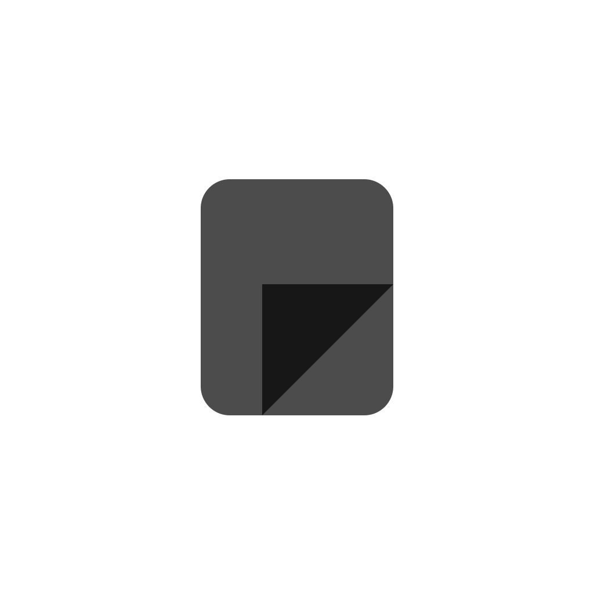
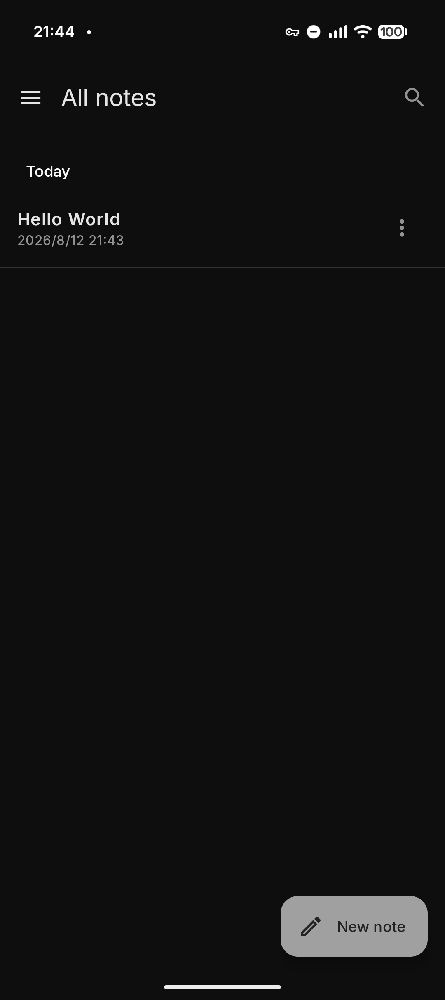
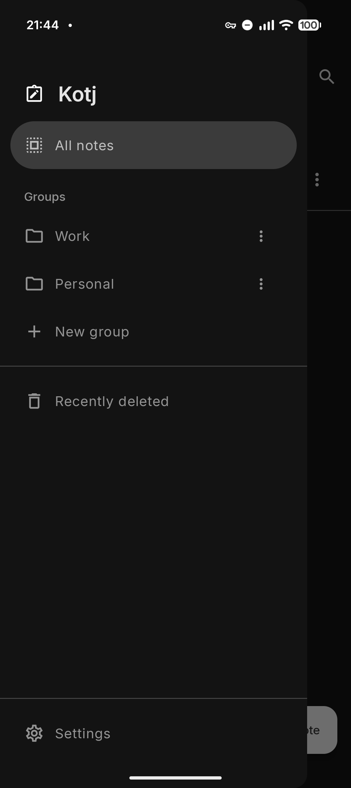
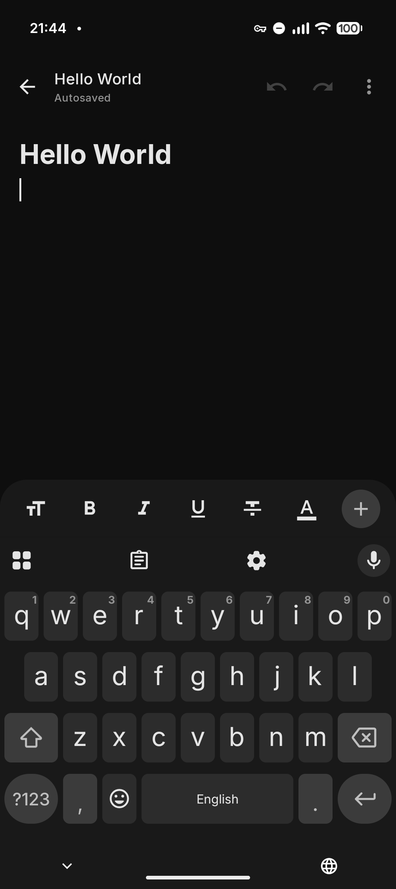
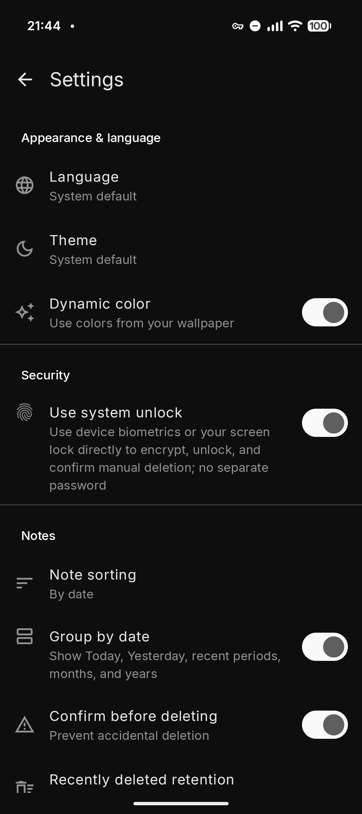

<p align="center">
  <a href="README.md">English</a> | <strong>简体中文</strong>
</p>

<div align="center">
  
  <h1>Kotj</h1>
  <p><strong>面向 Android 的完整本地备忘录</strong></p>
  <p>Material Design 3 界面 · 类 iOS 备忘录结构 · 丰富文本编辑 · 本地加密</p>

  [](https://developer.android.com/about/versions/oreo)
  [](https://kotlinlang.org/)
  [](https://github.com/lopleec/Kotj/releases/latest)
  [](LICENSE)
</div>

Kotj 是一款功能完整的原生 Android 备忘录应用。它借鉴 iOS 备忘录清晰直观的信息结构与编辑逻辑，同时使用 Jetpack Compose 和 Material Design 3 构建符合 Android 平台习惯的界面，而不是简单复刻 iOS 外观。

从日常速记到图文长笔记，Kotj 提供富文本、图片、表格、待办、分类、全局搜索、回收站、加密和多格式导入导出等完整能力。Kotj 默认仍是本地优先应用；只有用户主动开启试验性的 Google Drive 备份后才会使用网络。关闭时不登录 Google 账号、不请求云端，也不创建备份后台任务。

## 应用特点

- **专为 Android 构建：** 原生 Kotlin 与 Jetpack Compose，支持 Android 8.0 及以上版本
- **Material Design 3：** 使用 MD3 组件、动态配色、明暗主题以及符合 Android 习惯的系统交互
- **类 iOS 备忘录结构：** 熟悉的文件夹分类、笔记列表、最近删除和简洁的连续编辑体验
- **功能完整：** 富文本、图文混排、表格、列表、待办、搜索、置顶、导入、导出和加密均可直接使用
- **隐私优先：** 默认纯本地、不收集遥测，并可选择客户端加密的 Google Drive 备份

## 软件截图

<p align="center">
  
  
  
  
</p>

> [!IMPORTANT]
> 加密密码无法恢复。忘记独立密码、丢失系统解锁密钥或清除应用数据后，相应的加密笔记可能永久无法解密。

## 下载

从 [GitHub Releases](https://github.com/lopleec/Kotj/releases/latest) 下载最新的正式签名 APK。

- 支持 Android 8.0（API 26）及以上版本
- 包名：`com.lopleec.kotj`
- 安装 GitHub APK 时，Android 可能要求允许浏览器或文件管理器“安装未知应用”
- 从早期 Debug 版本迁移到正式签名版时，由于签名不同，无法直接覆盖安装；请先导出重要笔记

## 1.2.0 更新内容

- 新增可选的 Google Drive 自动备份，使用私有 `appDataFolder`，默认保持关闭
- 支持通过已授权 Google 账号免备份密码恢复：重新安装或更换设备后，可自动发现、解密并合并已有备份
- 本机与云端采用非破坏性合并：两端独有备忘录全部保留，同一备忘录采用更新时间较新的版本，时间相同则保留本机版本
- 上传前检查云端版本，防止较旧设备在未合并的情况下静默覆盖较新的云端快照
- 切换账号时会保留当前连接，直到新账号完成选择、授权与检查；中途取消不会更改原账号状态
- 优化随键盘展开的编辑工具抽屉、可叠加的下划线与删除线、任意位置可重复使用的标题样式，以及 Material 3 动画和间距

## 完整功能

### 编辑

- 新建后直接面对空白画布；任意一行都可以使用正文或标题样式，并可在任意位置重复使用标题样式
- 加粗、斜体、下划线、删除线和文字颜色
- 正文、大小标题、引用、编号列表、项目符号和原生复选框待办
- 表格、分界线与系统照片选择器图片插入
- 图片按原始比例显示，图片或其他对象后可继续输入
- 撤销、重做、文内查找、结果高亮与定位
- 空白备忘录退出时自动丢弃

### 整理与查找

- 全局搜索及结果高亮
- 自定义分类、移动备忘录与置顶
- 按更新时间或标题排序
- 可选日期分组：今天、昨天、过去 7 天、过去 30 天、月份和年份
- 最近删除、恢复、永久删除及可配置的自动清理时长

### 导入与导出

- 导入 TXT、Markdown、RTF 和 DOCX
- 导出 DOCX、Markdown 和纯文本
- DOCX 图片保持宽高比并采用流式写入，减少大文档导出时的内存占用

### Google Drive 备份（试验性、可选）

- 默认关闭；关闭时沿用原有本地编辑和存储路径
- 使用隐藏的 Drive `appDataFolder`，仅申请最小化的 `drive.appdata` 权限
- 本地内容变化后防抖自动备份，并在联网时执行周期备份
- 在上传前使用 AES-256-GCM 加密包含笔记数据库、分类、删除状态和附件的完整快照；可迁移恢复密钥保存在同一账号的私有应用数据目录
- 支持大体积图文备份的可恢复上传、“立即备份”以及切换 Google 账号
- 在新设备或重新安装后，会先配对已有快照与账号恢复密钥，并在合并完成前禁止上传；通过 Google 授权后即可合并本机与云端内容，无需单独备份密码
- 旧版密码备份会由创建它的原安装在下一次成功备份后自动迁移；尚未迁移时，其他安装无法进行免密码恢复
- 合并会保留两端独有内容；同一 ID 的备忘录采用更新时间较新的版本，时间相同则保留本机版本，并同步合并分类、最近删除状态与附件
- 每次上传前都会检查服务端版本；若云端已由另一台设备更新，旧设备会停止上传并要求先合并，避免覆盖较新的云端内容
- 关闭自动备份时，可选择保留云端内容和登录状态，或永久删除全部 Kotj 云端应用数据并撤销授权；本地备忘录始终保留
- 可选择“本地 + 云”或试验性的“云端优先”；为保证可靠编辑和离线使用，云端优先仍会保留必要的本地工作缓存

### 隐私与安全

- `INTERNET` 权限仅供用户主动开启的 Google Drive 备份使用；应用不收集遥测
- 关闭 Google Drive 备份时，不发起云端授权、网络备份，也不创建 WorkManager 备份任务
- 禁止明文网络流量，并继续关闭 Android 系统备份与设备迁移
- 独立密码加密，或直接使用 Android 系统生物识别/锁屏凭据
- 手动删除加密笔记需要再次验证；最近删除到期后可自动清理
- 加密笔记不以明文保存标题、正文或搜索索引
- 打开加密内容时阻止系统截图和最近任务预览

## 加密实现

笔记密码经 PBKDF2-HMAC-SHA256（独立随机盐、210,000 次迭代）派生为 AES-256 密钥，再使用 AES-GCM 加密。加密图片使用独立随机盐与 IV，并将内部文件名作为附加认证数据。系统解锁使用 Android Keystore 包装随机密码，每次解密都需要强生物识别或设备凭据认证。

Google Drive 备份使用随机 AES-256 密钥，在联网前加密完整逻辑快照。本机密钥副本由不可导出的 Android Keystore 密钥包装；可迁移副本与快照一同保存在该 Google 账号的私有 `appDataFolder`，因此恢复边界是 Google 账号授权，而不是独立备份密码。Kotj 不持久化短期 Google Access Token。

本项目采取了面向本地笔记应用的安全加固措施，但不代表经过独立第三方安全审计。发现安全问题时，请避免在公开 Issue 中附带真实笔记、密码或密钥材料。

## 技术栈

- Kotlin
- Jetpack Compose
- Material 3 与 Android 12+ 动态配色
- Android SQLite
- WorkManager 与 Google Identity Services 授权
- Google Drive `appDataFolder` REST API
- Kotlin Coroutines
- Android Keystore、BiometricPrompt 与系统 Photo Picker

## 从源码构建

### 环境要求

- JDK 21
- Android SDK 36.1
- Android Studio 或命令行 Android SDK 工具

```bash
git clone https://github.com/lopleec/Kotj.git
cd Kotj
./gradlew clean :app:lintDebug :app:assembleDebug
```

Debug APK 位于 `app/build/outputs/apk/debug/app-debug.apk`。

## 构建正式版

Release 构建开启 R8 代码优化、混淆和资源压缩，并且不会回退使用 Debug 签名。请在项目目录外保存密钥，并通过用户级 `~/.gradle/gradle.properties` 或同名环境变量提供以下配置：

```properties
KOTJ_RELEASE_STORE_FILE=/absolute/path/to/kotj-release.jks
KOTJ_RELEASE_STORE_PASSWORD=your-store-password
KOTJ_RELEASE_KEY_ALIAS=your-key-alias
KOTJ_RELEASE_KEY_PASSWORD=your-key-password
```

```bash
./gradlew clean :app:lintRelease :app:assembleRelease :app:bundleRelease
```

没有完整签名配置时，Gradle 只生成不可发布、不可直接安装的未签名产物。请勿提交密钥、密码、`local.properties` 或用户级 Gradle 配置。

## 项目结构

```text
app/src/main/java/com/lopleec/kotj/
├── backup/     # 可选的加密 Google Drive 备份
├── data/       # SQLite、设置与附件存储
├── export/     # DOCX、Markdown、TXT 导出
├── importer/   # TXT、Markdown、RTF、DOCX 导入
├── model/      # 笔记与编辑器数据模型
├── security/   # 密码、附件和系统解锁
└── ui/         # Compose Material 3 界面
```

## 参与贡献

欢迎提交 Issue 和 Pull Request。提交代码前请确保：

1. 未加入密钥、密码、个人笔记或其他敏感数据。
2. `./gradlew :app:lintDebug :app:assembleDebug` 能够通过。
3. 新功能同时考虑中英文界面、明暗主题和无障碍说明。
4. 涉及存储或加密格式的改动保持向后兼容，并说明迁移策略。

Google Drive 授权还要求在同一 Google Cloud 项目中创建 Android OAuth 客户端，并登记包名 `com.lopleec.kotj` 与签名证书 SHA-1。Android OAuth Client ID 和 Project ID 属于公开应用配置；请勿提交 OAuth 客户端密钥、签名密钥库或密码。

## 许可证

Kotj 依据 [GNU General Public License v3.0](LICENSE) 发布。分发修改版本时，请遵守 GPL-3.0 的源代码公开和许可证保留要求。
